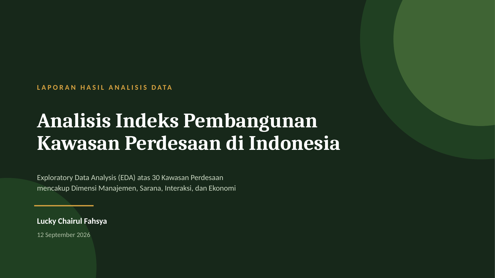
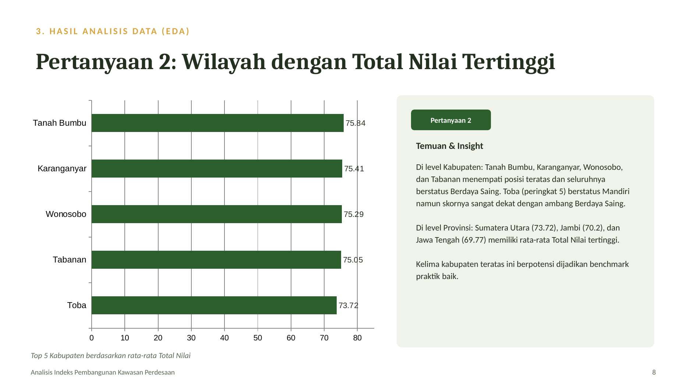
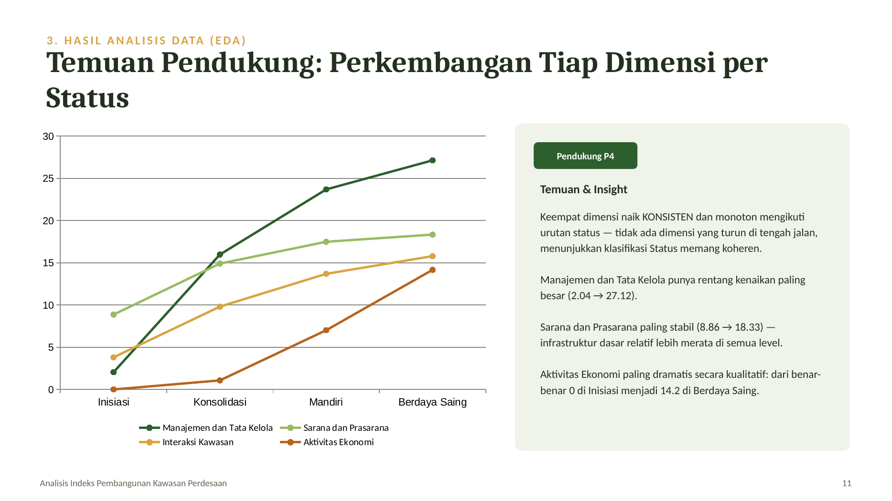
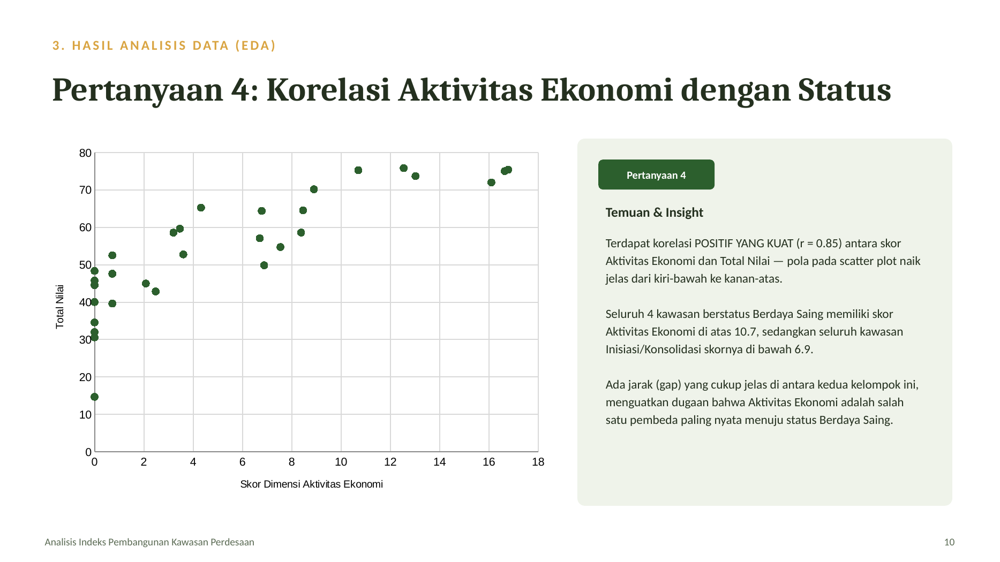
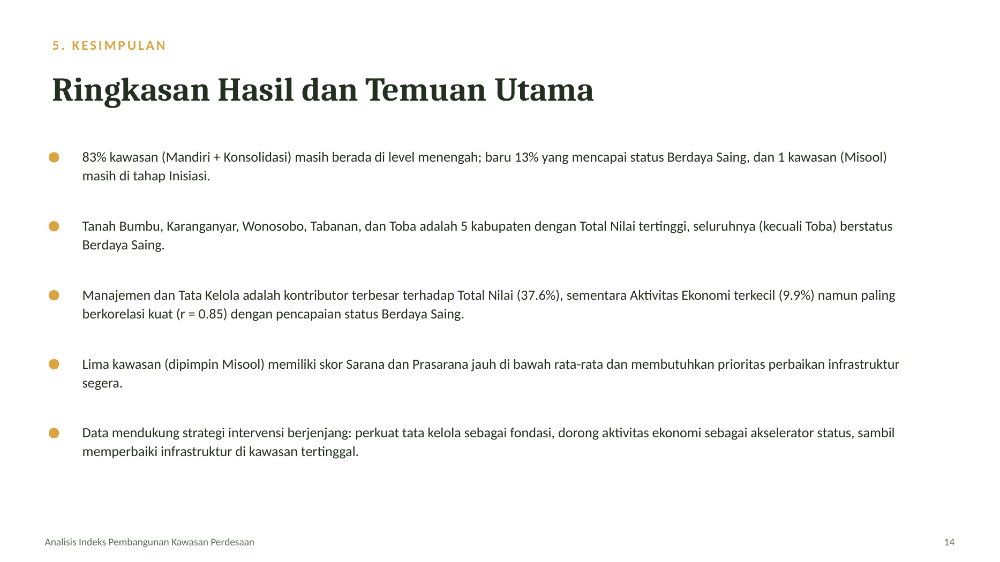

# 📊 Analisis Indeks Pembangunan Kawasan Perdesaan

Proyek analisis data end-to-end (data cleaning → exploratory data analysis → laporan akhir) atas 30 kawasan perdesaan di Indonesia, menggunakan Microsoft Excel (PivotTable, PivotChart, statistik deskriptif, dan slicer interaktif).



---

## 🎯 Latar Belakang & Tujuan

Pembangunan kawasan perdesaan di Indonesia diukur melalui **Indeks Pembangunan Kawasan Perdesaan**, sebuah skor gabungan dari empat dimensi:

- **Manajemen dan Tata Kelola**
- **Sarana dan Prasarana**
- **Interaksi Kawasan**
- **Aktivitas Ekonomi**

Berdasarkan skor gabungan (*Total Nilai*), setiap kawasan diklasifikasikan ke salah satu dari empat status perkembangan: **Inisiasi → Konsolidasi → Mandiri → Berdaya Saing**.

Proyek ini bertujuan menjawab lima pertanyaan analisis:

1. Bagaimana distribusi klasifikasi Status pembangunan kawasan perdesaan?
2. Provinsi/Kabupaten mana yang memiliki rata-rata Total Nilai tertinggi?
3. Dimensi mana yang menyumbang rata-rata proporsi nilai tertinggi terhadap Total Nilai?
4. Apakah ada korelasi antara skor Aktivitas Ekonomi dengan status Berdaya Saing?
5. Kawasan mana yang paling membutuhkan prioritas perbaikan infrastruktur?

---

## 🛠️ Proses & Tools

| Tahap | Yang dilakukan | Tools |
|---|---|---|
| **Data Cleaning** | Verifikasi 6 kategori masalah data (missing, duplicate, invalid, inconsistent, outlier, inaccurate); deteksi outlier dengan metode IQR | Excel, formula |
| **EDA** | Statistik deskriptif (mean, median, modus, std dev, variance, skewness, kurtosis), analisis korelasi, agregasi data | Excel PivotTable |
| **Visualisasi** | Pie, Bar, Line, Area, Scatter, dan Map Chart — sebagian besar dari PivotChart, dengan slicer untuk eksplorasi interaktif berdasarkan Status | Excel PivotChart, Filled Map |
| **Reporting** | Menyusun temuan menjadi laporan presentasi terstruktur | Slide deck → PDF |

Satu hal yang cukup menantang: Excel tidak mendukung **PivotChart untuk tipe Scatter dan Map** — jadi kedua chart tersebut dibangun langsung dari data mentah/hasil agregasi, bukan dari PivotTable, sebagai penyesuaian teknis yang disengaja (bukan kekurangan).

---

## 🔍 Temuan Utama

**1. Distribusi status masih didominasi level menengah**
83% kawasan berada di status Mandiri (43%) atau Konsolidasi (40%). Baru 13% yang mencapai Berdaya Saing.



**2. Aktivitas Ekonomi berkorelasi kuat dengan status Berdaya Saing**
Korelasi Pearson **r = 0.85** antara skor Aktivitas Ekonomi dan Total Nilai. Seluruh kawasan Berdaya Saing memiliki skor Aktivitas Ekonomi di atas 10.7, sedangkan kawasan Inisiasi/Konsolidasi seluruhnya di bawah 6.9 — ada gap yang jelas antar kedua kelompok.



**3. Keempat dimensi naik konsisten seiring naiknya status**
Tidak ada dimensi yang turun di tengah jalan — mengonfirmasi klasifikasi Status memang koheren dengan data yang mendasarinya. Manajemen dan Tata Kelola punya rentang kenaikan terbesar; Sarana dan Prasarana paling stabil/merata.



**4. Lima kawasan butuh prioritas perbaikan infrastruktur segera**
Skor Sarana dan Prasarana kelima kawasan ini jauh di bawah rata-rata nasional (16.27).

---

## 💡 Rekomendasi



---

## 📁 Struktur Repository

```
├── 01_data_cleaning/
│   └── Data_Cleaning_Kawasan_Perdesaan.xlsx     # verifikasi & pembersihan data mentah
├── 02_eda_dashboard/
│   └── EDA_Dashboard_Kawasan_Perdesaan.xlsx     # PivotTable, PivotChart, slicer interaktif
├── 03_laporan_akhir/
│   ├── Laporan_Analisis_Kawasan_Perdesaan.pdf   # laporan final (siap dibaca)
│   └── Laporan_Analisis_Kawasan_Perdesaan.pptx  # versi slide yang bisa diedit
└── assets/                                       # cuplikan visual untuk README ini
```

📄 **[Lihat laporan lengkap (PDF)](03_laporan_akhir/Laporan_Analisis_Kawasan_Perdesaan.pdf)**
📊 **[Buka dashboard interaktif (Excel)](02_eda_dashboard/EDA_Dashboard_Kawasan_Perdesaan.xlsx)** — coba klik slicer "Status" untuk melihat semua chart ter-filter otomatis.

---

## 📌 Catatan

Dataset yang digunakan berasal dari materi latihan program pelatihan data analytics. Seluruh tahapan cleaning, EDA, pivot table, visualisasi, dan laporan dikerjakan dan dikembangkan sendiri sebagai bagian dari proses belajar penerapan analisis data end-to-end di Excel.

---

**Dibuat oleh:** Lucky Chairul Fahsya
